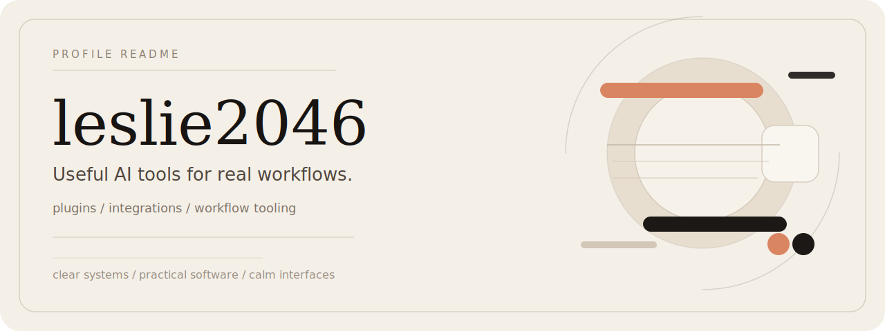

  

  <strong>Useful AI tools for real workflows.</strong> 
  Calm product thinking for practical AI workflows.

  I build plugins, integrations, and small developer tools around LLM products,
  with a bias for clarity, calm interfaces, and quiet usefulness.

  <a href="https://github.com/leslie2046?tab=repositories">All repositories</a>
  /
  <a href="https://github.com/leslie2046/dify-plugin-lingua">Plugins</a>
  /
  <a href="https://github.com/leslie2046/dify-ragflow-plugin">Retrieval</a>

<table>
  <tr>
    <td width="33%" valign="top">
      <strong>Building</strong> 
      Dify plugins 
      workflow integrations 
      small productized tools
    </td>
    <td width="33%" valign="top">
      <strong>Taste</strong> 
      minimal by default 
      readable over clever 
      software that earns its place
    </td>
    <td width="33%" valign="top">
      <strong>Exploring</strong> 
      retrieval systems 
      storage layers 
      AI workflow automation
    </td>
  </tr>
</table>

### Selected Work

| Project | What it points to |
| --- | --- |
| [`dify-plugin-lingua`](https://github.com/leslie2046/dify-plugin-lingua) | Language detection inside Dify workflows |
| [`dify-ragflow-plugin`](https://github.com/leslie2046/dify-ragflow-plugin) | Dify + RAGFlow integration for retrieval-heavy workflows |
| [`dify-plugin-minio`](https://github.com/leslie2046/dify-plugin-minio) | MinIO integration for storage-backed AI use cases |
| [`dify-plugin-juhe`](https://github.com/leslie2046/dify-plugin-juhe) | Juhe integration for practical Dify-based workflows |

> Build things that are clear before they are clever.

### Notes

I like tools that feel calm, understandable, and immediately useful.

If you're working on thoughtful AI tooling, workflow automation, or the Dify ecosystem, let's connect here on GitHub.
